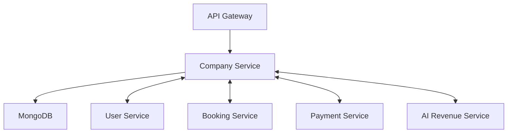

# BRB Company Microservice

## 🎯 Overview
The **Company Management Microservice** is a core component of BRB's salon management platform. This service handles all company-related operations, including:
- Salon management
- Employee scheduling
- Service bookings

## 🏗️ Microservice Architecture


### 🔗 Service Dependencies
- **User Service**: Authentication and user management
- **Booking Service**: Appointment scheduling
- **Payment Service**: Transaction processing
- **AI Revenue Service**: Revenue predictions
- **Storage Service**: File management

## 🛠️ Tech Stack
- **Framework**: NestJS v10
- **Runtime**: Node.js ≥20.16.0
- **Database**: MongoDB with Mongoose ODM
- **API**: REST with Fastify
- **Documentation**: Swagger/OpenAPI
- **Testing**: Jest
- **CI/CD**: GitHub Actions

## 📋 Prerequisites
```json
"engines": {
    "npm": ">=10.5.0",
    "node": ">=20.16.0"
}
```

## 🚀 Quick Start

### Installation
```bash
# Install dependencies
yarn install
```

### Configuration
Create a `.env` file with the following:
```env
# App
APP_PORT=3000
APP_PREFIX=api/v1
APP_HOST_SERVER=http://localhost:3000

# MongoDB
MONGO_PREFIX=mongodb
MONGO_URL=localhost:27017
MONGO_DB=brb_company_db

# Service URLs
USER_SERVICE_URL=http://localhost:3001
BOOKING_SERVICE_URL=http://localhost:3002
PAYMENT_SERVICE_URL=http://localhost:3003

# JWT
JWT_SECRET=your_secret
JWT_EXPIRE=24h
```

### Development
```bash
# Local development
yarn start:dev

# Production build
yarn build
yarn start:prod
```

## 📚 Core Features

### Company Management
- Salon profile management
- Business settings
- Location management
- Revenue tracking

### Employee Management
- Staff profiles
- Schedule management
- Service assignments
- Performance tracking

### Service Catalog
- Service management
- Category organization
- Pricing configuration
- Availability control

## 🔐 Security
- JWT Authentication
- Role-Based Access Control (RBAC)
- Request validation
- Rate limiting

## 🧪 Testing
```bash
# Unit tests
yarn test

# E2E tests
yarn test:e2e

# Test coverage
yarn test:cov
```

## 📂 Project Structure
```
src/
├── app.module.ts
├── main.ts
├── common/
│   ├── config/
│   ├── decorators/
│   ├── guards/
│   └── interservices/
└── modules/
    ├── company/
    ├── employee/
    ├── service/
    └── location/
```

## 🔄 CI/CD Pipeline
- Automated testing
- Code quality checks
- Docker image building
- Automated deployment

## 📝 API Documentation
Access Swagger documentation at:
```
http://localhost:3000/api/docs
```

## 🐳 Docker Support
```bash
# Build image
docker build -t brb-company-service .

# Run container
docker-compose up
```

## 💻 Local Development

### Environment Setup

#### Node
Since the environment will be launched in Docker, `node_modules` will not exist on the host. Therefore, it is necessary to install the dependencies locally to avoid issues with editors and to run some commands. Below are the steps to follow:

- Ensure Node.js version 20.16.0 is installed on the machine. Using `nvm` (Node Version Manager) is recommended to manage versions efficiently.

#### Install Yarn
```bash
npm install --global yarn
```

#### Install Dependencies
```bash
yarn install
```

**Note**: If you're using Visual Studio Code and errors persist after installation, try restarting the application.

#### Docker
Make sure Docker is installed and the engine is running so you can execute the commands in the following steps.

### Starting the Server
To start the server locally, use the Dockerfile and `docker-compose.local.yml` as they contain the necessary configuration to launch the Node app and the database.

To execute it:
```bash
docker-compose -f .\docker-compose.local.yml up
```
To run in the background:
```bash
docker-compose -f .\docker-compose.local.yml up -d
```

### Environment Variables Management
#### `.env` vs `.env_example`
- The `.env` file should not be committed to the repository for security reasons.
- The `.env_example` file will be committed and should contain the same variables but with annotations or placeholder values for confidential variables. Share confidential values internally via secure project communication channels.

#### Nest Environment
- Validate the configuration file schema when working with NestJS. Ensure that any new variable is included in its respective file under `src/common/config`.

### Installing New Dependencies
To install new dependencies, use Yarn:
```bash
yarn add <new-dependency>
```
Then rebuild and restart the container:
```bash
docker-compose -f .\docker-compose.local.yml down
docker-compose -f .\docker-compose.local.yml build
docker-compose -f .\docker-compose.local.yml up
```

## 🧹 Linter and Formatter
### Run Linter
```bash
docker exec -it ${DOCKER_CONTAINER_APP_NAME} yarn run lint
```
### Run Formatter
```bash
docker exec -it ${DOCKER_CONTAINER_APP_NAME} yarn run format
```
**Note**: These can also be run from the host if the necessary libraries are installed.

#### Recommended Extensions
For real-time linting recommendations, install the **ESLint** extension by Microsoft in VSCode.

## 💬 Commits
To maintain structured commits, the project uses **Commitizen**.

### Process
Run the following command:
```bash
yarn run commit
```
Follow the interactive steps:
1. Select the type of commit (e.g., `feat` for a feature, `fix` for a bug fix).
2. Specify the scope/component (e.g., `users` for the user module).
3. Provide a short description.
4. Optionally, add a detailed description.

## 🧪 Running Tests
### Run Tests
#### Only Test Results
```bash
docker exec -it app yarn run test
```
#### Test Results with Coverage
```bash
docker exec -it app yarn run test:cov
```

## 🚀 Deployment to Stage or Production

### Migration Management
- Use the `.env` file to point to the remote database. Ensure access through IP, proxy, or any required method.
- Only designated personnel should run migrations.

### Docker
For production, a different Docker Compose file (`docker-compose.yml`) is used. This configuration excludes the database and is optimized for production environments.

## 🤝 Contributing
- Follow BRB's coding standards.
- Write clear commit messages.
- Include tests for new features.
- Update documentation.

## 📜 License
Proprietary - BRB © 2024

## 🤝 Support
For internal support:
- **Slack**: `#company-service-support`
- **Email**: `support@brb.com`
- **Confluence**: [Company Service Wiki](#) (internal link)

**Note**: This is a private repository. For access, please contact the BRB DevOps team.
